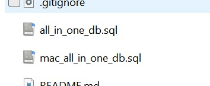

# Learning Journey Planning System #

Learning Journey Planning System (LJPS) is an enterprise solution that services as personal Learning Journey tracker that could guide All-In-One's staff on the courses they could take to prepare them for a new Role in their organisation. LJPS serves 3 target users, namely Staff, Managers and Human Resource (HR). Each role has specific application features that they have access to. 

This is the first release of LJPS which contains its core functionalities as provided by the Product Owner. 

## Prerequisites ##
The team has built requirements.txt which stores the required Python libraries to be installed. In Command Prompt (Windows) / Terminal (Mac), navigate to SPMG5T6 directory and run the following command to install all dependencies in our enterprise solution.

   1. For both Windows & MacOS users

       ```
       pip install -r requirements.txt
       ```

MySQL Workbench should also be installed in the local computer.
* Refer to this [installation guide](https://dev.mysql.com/doc/workbench/en/wb-installing.html) from the MySQL Workbench manual. This includes guides for Windows and MacOS users.

## Access to Database ## 
Our MySQL databases are managed by phpMyAdmin. In order to create and populate the databases:

 1. Launch WAMP/MAMP server and access phpMyAdmin through this URL http://localhost/phpmyadmin/

      1. Login credentials for Windows users

         Username: root<br>
         No password required<br>

      2. Login credentials for MacOS users

         Username: root<br>
         Password: root<br>

   2. Navigate to the Import tab

      

   3. Click on "Choose File" and navigate to ```main``` directory in ```SPMG5T6``` repository.

      * Install the respective SQL files as shown below
  
        For Windows users: Install all_in_one_db.sql 
        
        For Mac users: Install mac_all_in_one_db.sql
  
        

      * Under "Under Options", deselect "Enable foreign key checks" 

         

      * Click on "Go" on the bottom right

        

   4. The page will appear as such if the database has been successfully imported.

      

## Access to Frontend UI ##

For the frontend files to function, SPMG5T6 repository has to be saved in the webroot.


<br>

The user process first begins at the [Login Page](http://localhost/SPMG5T6/ui/login.html) where they can login using their <ins>Staff ID</ins>. 

From then on, users will be brought to a homepage based on their role. 

* [Human Resource (HR)](http://localhost/SPMG5T6/ui/hr/homepage_hr.html) 
* [Manager](http://localhost/SPMG5T6/ui/manager/homepage_manager.html) 
* [Staff](http://localhost/SPMG5T6/ui/staff/homepage_standard.html)

## Role Features ##

### All Roles ###
* View the roles offered on LJPS
* Create/edit/delete learning journeys based on the role they want to pursue
* View completed/in-progress courses
* View attained skills

### Human Resource (HR) ###
* Create/edit roles and skills on LJPS
* Soft delete functionality on roles and skills on LJPS

### Manager ###
* View all team members in a page
* Quick look at the <ins>number</ins> of ongoing/completed courses and skills by each team member
* View the ongoing/completed courses and skills by each team member

## Course and Team Information ##

IS212 Software Project Management<br>
AY2022-2023, Term 1<br>
Section 5<br>
Team 6

## Authors ##

* Bruno Goh Jing Hang bruno.goh.2020.scis.smu.edu.sg <br>
* Bryan Shing Wen Yan bryan.shing.2020@scis.smu.edu.sg<br>
* Jann Chia Rui Qi jann.chia.2020@scis.smu.edu.sg<br>
* Tan Yu Qing Rhys rhys.tan.2020@scis.smu.edu.sg<br>
* Teow Zhen Yang Dominic dominicteow.2020@scis.smu.edu.sg <br>
* Yap Jie En Kelvin kelvin.yap.2020@scis.smu.edu.sg <br>
